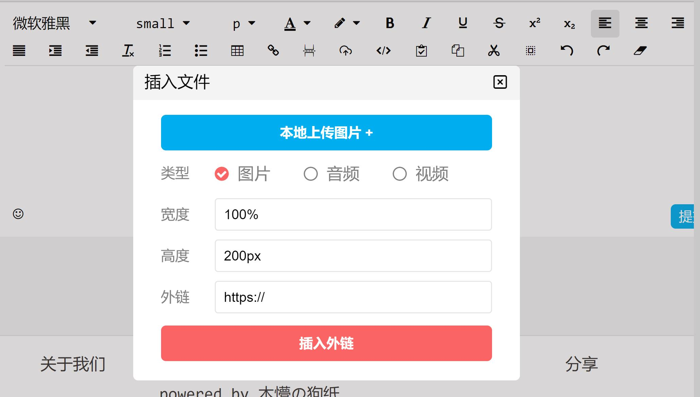

<!--
 * @Author: your name
 * @Date: 2020-01-06 19:00:10
 * @LastEditTime : 2020-01-11 22:46:41
 * @LastEditors  : Please set LastEditors
 * @Description: In User Settings Edit
 * @FilePath: \nuxt-ssr\components\commons\editor\readme.md
 -->

# 基于Vue，sass，ts开发的富文本编辑器

- 需要Vue，sass，ts环境

- 需引入css目录的样式

- 引入组件和_edit.scss样式

``` html
<EditComponent :options="options" @recieveContent="recieveContent(obj)"/>
```

- xss攻击请在后台采取措施，前端不做处理，请不要对所有<,>进行转义,不要对code标签内的内容进行处理。
应过滤以下非code标签内的，正则匹配的内容

``` js
/<javascript\/?>|.+\.js|on.+=.*|javascript:.+|cookie|localStorage|sessionStorage|window|this|document|eval|location|send\(.*\)/
```

- 只有图片支持本地上传,若觉得该组件有参考价值可自行改造

## **api**

- @input
  - Object[例子]:

``` js

{
    maxsize: 1024*1024*1024*2, // 编辑内容最大字节数
    image:{
        echo: '<p>🚀我是一个编辑器,快来点我吧~</p>', // 回显
        count:5, // 图片上传最大张数
        base64:1024*1024*100, // 单位字节，图片大小小于该数值使用base64转义图片，不传该参数时或传入0时，走图床地址server.api
        // 未实现，需后台造接口
        server: {
            enable: false, // true-server可用，false-不可用
            api:xxx, // 上传url
            filename: "file", // 文件name
            error:{code:400},// 默认400上传失败
            success:{code:200} // 默认200上传成功
        }
    }
}

```

- @output
    -Object

``` js
{
    innerHTML: html, // 编辑内容为html
    innerTEXT: textContent, // 编辑内容文本，不含html
    // 外链或base64
    urls: {
        image:[
            {type:'url',src: 'http://xxx.png'},
            {type:'base64',src: 'data:image/png;base64,xxx'},
            ...
        ],
        audio:[], // 与image类似（无base64-大文件不适用base64）
        video:[]  // 与image类似（无base64-大文件不适用base64）
    }
}
```

## 截图



## by 木懵の狗纸🐕
